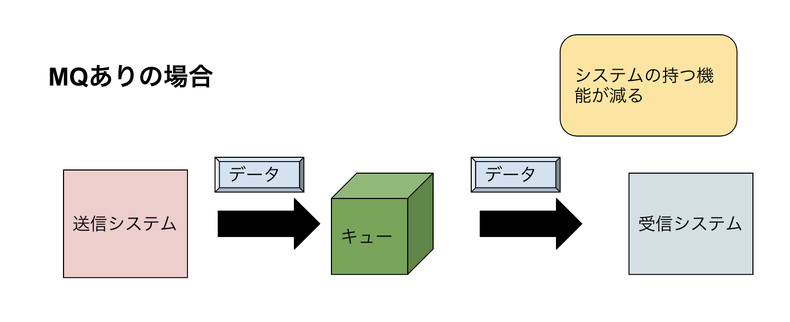

# Message Queueing について

## Message Queueing とは

Message Queueing(以下、MQ)とは、システム上でデータを通信する際の通信方式の一つです。  
この方式では、データを送信する際に受信システムに直接送信するのではなく、キューにデータを格納し、受信システムは任意のタイミングでキューからデータを受け取ります。  
データ通信では通常、送信側は受信側の状態を、受信側は送信側の状態を確認する必要があります。 この場合、それぞれのシステムに「相手側の状態を確認する機能」を実装する必要が出できてしまいます。
機能は分散すべき、というシステム開発の基本的な考えによれば、これはあまり芳しくありません。  
加えて、実装が互いのインターフェース、サーバー性能(処理時間など)に左右されてしまうため、システム全体の独立性が落ちてしまう、という欠点があります。サーバーを更新した際などに実装を
変更する必要がある、というのも問題点の一つですね。


そこで、MQ アルゴリズムでは送信サーバーからのデータを「メッセージ」という単位ごとにキューに格納しておき、受信サーバーはキューから好きなタイミングでデータを取り出し、処理します。  
これにより、送信サーバーと受信サーバーが直接通信することがなくなり、システム全体の独立性が上がります。 また負荷分散の観点から見てもこのアルゴリズムは優れています。 通常の通信では
片方のサーバーがサーバー負荷により処理性能が落ちた場合、もう片方の実行にも影響が出ます。ですが、MQ では直接通信が発生しないことにより、片方のサーバーの負荷がもう片方のサーバーの
処理に影響を与えません。



## MQ の実装(amqplib)

では、MQ を実装してみます。  
MQ を実装できるオープンソースソフトウェアに「RabbitMQ」があります。 今回は Node.js から RabbitMQ にアクセスしてみます。  
Node.js から RabbitMQ にアクセスできるライブラリは複数ありますが、今回は「amqplib」を用います。 インストールは以下です。

```sh
npm install --save ampqlib
```

では、送信側の処理と受信側の処理をそれぞれ実装していきます。

#### 送信側の処理

```tsx
import * as ampq from "amqplib";

const QUEUE = "message-queue";

function wait(ms: number) {
  return new Promise(resolve => setTimeout(resolve, ms));
}

(async function main() {
  const connection = await ampq.connect(
    "amqp://localhost",
    function (error: Error, connection: ampq.Connection) {
      if (error) {
        throw error;
      }
    },
  );

  const channel = await connection.createChannel();
  channel.assertQueue(QUEUE);
  let send_counter = 0;

  while (send_counter < 100) {
    const message = `Hello ${send_counter}`;
    channel.sendToQueue(QUEUE, Buffer.from(message));
    console.log("send ", message);
    await wait(1500);
    send_counter++;
  }

  await channel.close();
})();
```

ampqlib では、最初に connect()関数で connection を取得してから createChannel などで
channel を作成し、channel に実装されたメソッドでクエリを処理します。ここでは channel.sendToQueue メソッドでキューに 100 回メッセージを送信しています。

#### 受信側の実装

```tsx
import * as ampq from "amqplib";

const QUEUE = "message-queue";

function wait(ms: number) {
  return new Promise(resolve => setTimeout(resolve, ms));
}

(async function main() {
  const connection = await ampq.connect(
    "ampq://localhost",
    function (error: Error, connection: ampq.Connection) {
      if (error) {
        throw error;
      }
    },
  );

  const channel = await connection.createChannel();
  await channel.prefetch(1);
  channel.assertQueue(QUEUE);

  await channel.consume(QUEUE, async function (message) {
    console.log("Receive");
    await wait(1500);
    channel.ack(message);
  });
});
```

受信側は、channel.consume()メソッドを用いることで受信宣言をすることができ、キュー内のメッセージを全て受信した後も
新たなメッセージを随時取得します。

## おわりに

ここで紹介した機能だけだと、様々な要因でシステム障害が発生します。機会があればまたそこについても更新していこうとい思います。
